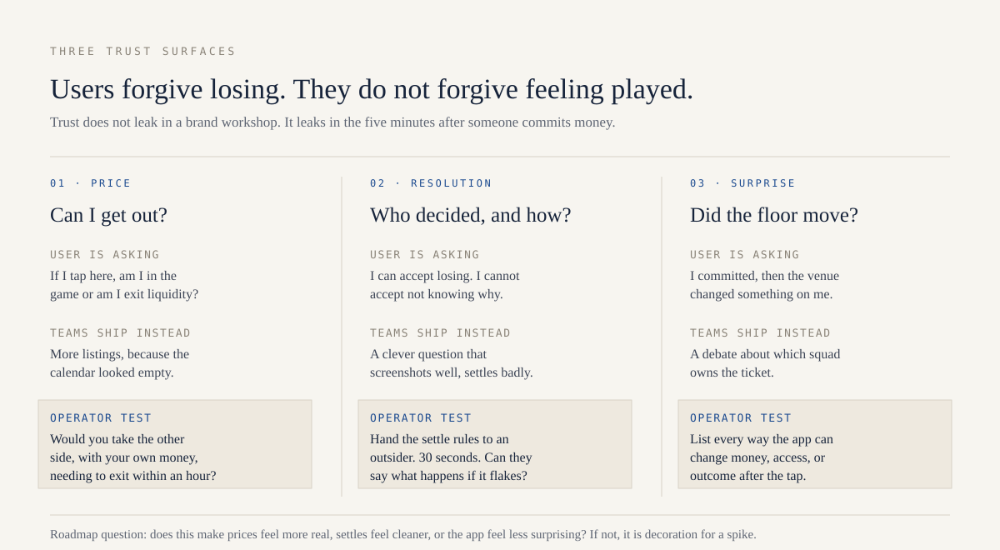

<!-- EVIDENCE
Claim: Market products leak retention on exactly three surfaces, price quality, resolution clarity, and post-commit surprise, and a roadmap item that improves none of them is decoration.
Moment: {{MOMENT: the specific incident that made the three-surface split obvious. Which surface leaked, what the user saw, and roughly when. Category level, no confidential detail.}}
Numbers: {{NUMBERS: at least two, with units and windows. Candidates that leak nothing: ratio of support tickets tagged resolution versus price, share of markets a user could exit within an hour, time from settle to explanation published.}}
Names: price quality, resolution clarity, surprise, the settle explainer, tools/resolution-risk, the fair loser cohort.
Cost: {{COST: the roadmap item you shipped that improved a dashboard and taxed one of the three surfaces, and what it cost. This field is what separates the essay from a framework post.}}
Counterexample: A venue can win on all three surfaces and still fail commercially. Trust is necessary and not sufficient, and a perfectly trustworthy market with no distribution is a well-built empty room.
Reader action: Retag the last 50 support tickets against price, resolution, and surprise, and see which surface the roadmap has been ignoring.
-->

# People don’t quit because they lost. They quit because they felt hustled.

<figure>

<figcaption>The three surfaces, the question each one answers, and the test I run on each. Take this diagram, not the essay.</figcaption>
</figure>

Here’s the part nobody puts in the launch deck: users will forgive a bad beat. They will not forgive feeling played.

I’ve watched people lose money and open the app the next morning. I’ve also watched people win once, feel something off about the venue, and never come back. Same balance change. Opposite story in their head.

The winner who felt hustled will tell a sharper story than the loser who felt respected. Screenshots do not capture that story. Retention cohorts do.

That gap is the whole product.

Retention in prediction markets is not mainly a “more markets” problem. It’s a trust problem that shows up in three boring places. When something breaks, you need to know which surface leaked. Otherwise you ship another campaign on top of a hole.

---

### The user who tells the truth about your product

Forget the whale. Forget the screenshot farmer. Forget the person who only shows up when the world is watching.

Think about one person.

They put real money on a question they understood. The price moved against them. They lost. Fairly. No mystery. No gotcha. And somehow they still trust the room enough to come back on a quiet Tuesday.

That person is your real retention cohort. Everyone else is traffic.

Most roadmaps are built for traffic. Traffic claps during the spike. Your cohort decides whether you have a venue or a pop-up.

So the question is not “how do we get more people in the door?” The question is: what would make the fair loser stay?

In practice, trust fails on three surfaces. Not in a brand workshop. In the five minutes after someone commits money.

---

### 1. The price has to feel real

<figure>

<figcaption>What is: a chart that looks like a market. What could be: a price you can enter and exit without feeling like exit liquidity.</figcaption>
</figure>

Nobody is studying your depth chart for fun. They’re asking a simpler question: if I tap here, am I in the game, or am I the exit liquidity?

Dead markets teach that lesson in one session. Fat spreads. Ghost mids. You can’t get out without eating glass. The UI can look expensive and the product still feels like a toy.

**What teams ship:** more listings, because the calendar looks empty and growth wants “content.”

**What users learn:** this place is decorative. The number on the screen is not a price. It’s a suggestion with teeth.

The usual response is to list more stuff. That usually makes it worse. You trade one liquid question people understand for forty thin ones that exist to fill a slide.

I’d rather ship fewer markets that behave like markets. Maker incentives, listing bars, killing decorative inventory: those are product calls, not finance chores. And if a market is thin, say so. Silence is UX too. People fill silence by assuming you’re hiding something.

**Operator test:** Would you put your own money in, knowing you might need to exit in the next hour? If the honest answer is “only if nothing moves,” you don’t have a market. You have a prop.

---

### 2. Resolution is UX (yes, even if legal owns the doc)

<figure>

<figcaption>People accept the verdict. They do not accept a verdict that feels negotiable after the fact.</figcaption>
</figure>

This is the surface product teams duck because it looks like ops.

People accept losing. They do not accept not knowing why. Fuzzy rules are not a “we’ll clarify if it comes up” ticket. They’re a defect with a financial blast radius.

The clever question that performs in a growth channel is often the dispute waiting to happen. It screenshots well. It settles badly.

**What is:** a market copy that sounds sharp in a feed, a resolution doc written for lawyers, and a support queue that inherits the gap.

**What could be:** a settle story so boring that nobody argues. Named source of truth. What happens if that source is late or conflicts. An explainer a normal person can read in thirty seconds.

My bar before something lists: if you can’t write that explainer without squirming, the market isn’t ready. Ship it anyway and you’re borrowing trust from every clean settle you’ve ever done. One messy outcome can spend that balance faster than a quarter of good ones can rebuild it.

Committees, oracles, challenge windows: users don’t care which architecture you picked. They care whether the outcome felt inevitable afterward, or negotiable.

**Operator test:** Hand the settle explainer to someone outside your team. Give them thirty seconds. Can they tell you how it resolves, and what happens if the source flakes? If they shrug, the market is not ready. Your legal doc is not a product.

---

### 3. The app has to stop surprising people

<figure>

<figcaption>In a social app, surprise is annoying. In a market, surprise feels extractive. Same pixel. Different moral.</figcaption>
</figure>

Fees that only show up after you confirm. PnL that doesn’t match the math in your head. Orders that hang during the only five minutes anyone cared about. A market resolves and nobody tells you. A restriction appears with no explanation.

In a social app, surprise is annoying. In a market, surprise feels extractive.

Users don’t split “eng latency” from “compliance hold” from “bad copy.” They experience one brand that might jerk them around. Your org chart is invisible. Their stomach is not.

**What teams debate:** which squad owns the ticket.

**What the fair loser feels:** I committed, then the venue moved the floor.

I treat “surprised by numbers” and “surprised by availability” like P0s, same family as a bad settle. If your support tags can’t point tickets at price quality, resolution, or integrity, you’ll keep pouring growth on a leak you refuse to name.

Surprise is also where well-meant AI features go to die. A fluent explainer that invents a fee, misstates eligibility, or sounds certain about a fuzzy settle does not feel like innovation. It feels like the venue talking out of both sides of its mouth. If you ship assistance near money, hold it to the same surprise bar as the rest of the app.

**Operator test:** List every place the app can change the user’s expected money, access, or outcome after they’ve already committed. For each one, ask: did we explain it before the tap, or only after the flinch? After is too late.

---

### What the leaks actually cost

Three surfaces, three price tags. None of these are hypothetical.

**Price.** Sector open interest was $1.11B on 1 May 2026 against $8.6B of April volume, so about 13% of the headline is positions anyone is actually holding. Depth is rarer than the volume charts imply. Making it feel real has a number: to hold slippage at or under 0.5% for a $500 order at 50 cents, an LMSR needs a liquidity parameter of 49,750, which is a worst-case subsidy of $34,484 per market. List 40 of those and you have committed $1,379,374.

**Resolution.** A Polymarket contract on the Ukraine minerals deal moved from 9% to 100% between 24 and 25 March 2025 and resolved YES with no agreement reached, after an attacker cast 5M UMA, about 25% of that round. A separate dispute over whether Strategy sold Bitcoin in May ran past $60M, and it turned on the word "significant" sitting in a sentence with no test in it. A Wall Street Journal investigation in May 2026 found that in most disputed markets more than half the votes came from the 10 largest wallets, and at least 60% of active UMA voters could be linked to live Polymarket accounts.

**Surprise.** No public number, which is the point. It shows up as support tickets per 1,000 users and nobody publishes that.

The surfaces are 1 system. A clean settle on a dead market still teaches that prices are cosplay. A liquid book with a surprise fee still feels extractive. Assign the 3 to different squads without a shared vocabulary and you ship local wins and global churn.

So support tags and roadmap reviews should speak the same 3 words: price, resolution, surprise. A ticket that cannot point at 1 of them belongs in the decoration pile.

---

### The only roadmap question I trust

<figure>

<figcaption>Tuesday. No parade. No final. Just the product you actually built.</figcaption>
</figure>

Campaigns amplify whatever you already are. June 2026 made that obvious: Kalshi and Polymarket cleared $44.8B combined, the charts looked like product-market fit, and then the tournament ended.

If Tuesday is empty, you did not build a venue. You rented a crowd.

So when a roadmap item shows up, new game mode, new reward, new tab, new AI wrapper, I ask 1 thing.

Does this make prices feel more real, settles feel cleaner, or the app feel less surprising?

If not, it is decoration for a spike.

The follow-up question in the same meeting is the useful one: name which of the 3 surfaces gets worse if we ship this half-finished. Growth features routinely improve a dashboard while quietly taxing surprise or resolution, and an unspoken tradeoff becomes a 1-star user story 6 weeks later.

The other world is not exotic. Fewer markets, each one exit-able at $500. Settles plain enough to bore Twitter. An app that does not flinch after the tap.

The person who lost fairly and came back is not a metric. They are proof you built something worth a second session.

---

### Takeaway

Users do not churn because they lost. They churn because the venue felt uneven.

Pressure-test 3 things before the next growth idea. Can someone enter and exit this market at size? Could a non-lawyer explain the settle in 30 seconds? Where can the app still surprise someone after they have committed?

Build for the user who lost money fairly and came back anyway. That cohort is the only one worth growing.
