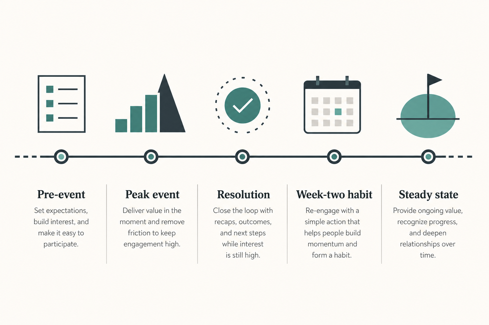
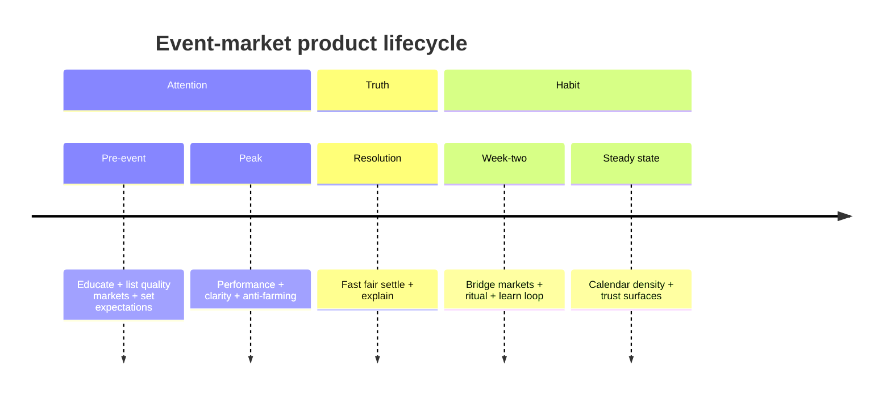
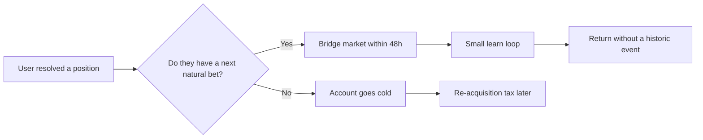
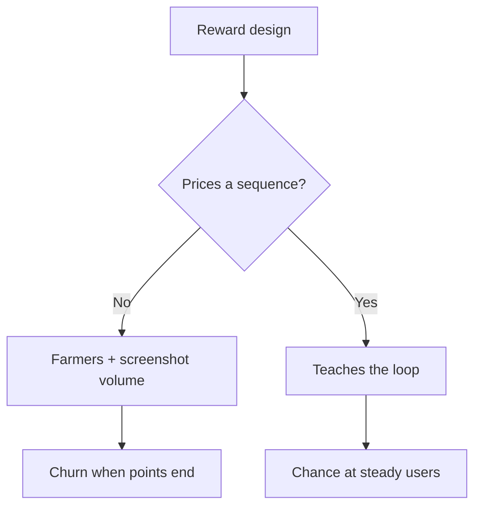

# After the final: designing prediction markets for the Tuesday nobody watches

**Series:** Market Ops Notes · Article 02  
**Pillar:** Markets as products  
**Length:** ~2,000 words · **Read time:** ~9 min  
**Best channels:** Newsletter cornerstone · LinkedIn teardown series  
**Status:** Draft v1 for your review

---

## TL;DR

Marquee events create the illusion of product-market fit.

The 2026 World Cup cycle made this impossible to ignore: prediction-market volume and attention spiked around the tournament, then cooled as the calendar went quiet. Public reporting described sharp post-final declines in weekly volume on major venues (order-of-magnitude: large percentage drops within ~2 weeks — treat secondary outlets as directional, not gospel).

The product question is not “how do we make the final bigger?”  
It is **what Tuesday looks like after the final.**

This article gives you a lifecycle system: **Pre → Peak → Resolve → Week-two → Steady**, with retention mechanisms that don’t depend on the next historic night.

---

## The spike is not the product

During a mega-event, almost everything gets easier:

- Distribution (everyone is already talking about the same thing)
- Market comprehension (the question is culturally obvious)
- Emotional urgency (people want a position *now*)
- Social proof (friends, feeds, group chats)

When the event ends, you lose the free marketing engine. What’s left is your actual product:

| What the spike proved | What it did **not** prove |
|----------------------|---------------------------|
| People will trade when the world is watching | People will form a habit |
| Your funnel can convert attention | Your loop survives boredom |
| Liquidity can congregate on one narrative | Your venue has a year-round reason to exist |

Pew’s broader volume chart (Kalshi + Polymarket rising into 2026) shows category momentum. Event tears show something sharper: **attention is rented; habit is owned.**

Secondary analyses of the World Cup window also argue a structural point worth sitting with: sports markets are often **pure speculation ecosystems** — few natural hedgers — so volume can look institutional while remaining emotionally retail. That’s not a moral judgment. It’s a product constraint: your retention design cannot assume “utility hedging” will keep people around.

---

## The five-stage event lifecycle

### Stage 1 — Pre-event (T‑14 to T‑1)

**Job:** Convert curiosity into competent first trades *without* training farmers.

Ship:
- “How this market works” for first-timers (2 minutes max)
- Resolution explainers before money is in
- A curated set of liquid markets (not 80 thin ones)
- Expectation setting: fees, exits, what happens if delayed

Kill:
- Rewards that only pay for “trade once during the event”
- Ambiguous viral questions

### Stage 2 — Peak (live window)

**Job:** Don’t break trust while the stadium is full.

Ship:
- Performance budgets (order path, app stability)
- Real-time status honesty (“delayed,” “halted,” “thin”)
- Support macros ready for the three trust surfaces
- Risk/compliance monitoring that doesn’t surprise-ban without a story

Kill:
- Silent failures
- Changing rules mid-event without communication

### Stage 3 — Resolution (T+0 to T+2)

**Job:** Make fairness legible.

Ship:
- Fast settlement when source of truth is clear
- Push + in-app: “Resolved — here’s why”
- Clear balance/position truth after settle
- One-tap path to a **next** market (designed, not random)

Kill:
- Resolve with no explanation
- Dumping users on a dead home feed

### Stage 4 — Week-two (the real product)

**Job:** Replace the marquee with a ritual.

This is where most teams under-invest because dashboards still glow from Peak.

**Bridge design principles**
1. **Same identity, smaller stakes** — “You followed Team X / Theme Y — here are ongoing markets”
2. **Higher frequency, lower majesty** — leagues, weekly politics, macro prints, culture markets (category mix matters; Kalshi-style diversification is often cited as a stabilizer vs pure mega-event dependence)
3. **Teach a loop, not a lottery** — watch → decide → position → resolve → review → return
4. **Rewards price sequences**, not screenshots — return after resolve, multi-day activity, non-wash patterns

### Stage 5 — Steady state

**Job:** Be a venue, not a pop-up.

Metrics that matter more than Peak Day Volume:
- D7 / D30 retention of **event-acquired** cohorts (separate from organic)
- % of event users who trade a **non-event** market within 14 days
- Median markets traded in first 30 days
- Support tickets per 1k event users (trust leak detector)
- Liquidity quality on bridge markets (don’t bridge into ghost towns)

---

## A practical “After the Final” playbook

### T+0 to T+48 hours

1. Resolution communications live  
2. “Your tournament” recap: what you traded, what you learned (not gamified shame)  
3. Bridge module: 3–5 markets max, personally relevant, liquid  
4. Turn off or reshape event-only incentives  

### T+3 to T+14 days

1. Lifecycle messaging: education > FOMO  
2. Habit nudge tied to a recurring calendar (matchday / data release / weekly brief)  
3. Creator/community layer only if it drives understanding, not spam  
4. Review farming: did rewards create a cohort or a mercenary wave?

### T+15 to T+45 days

1. Cohort autopsy: who stayed, what they traded, what they ignored  
2. Listing strategy: cut decorative markets  
3. Write the memo leadership needs: “Peak ≠ PMF”

---

## Incentives: the silent retention killer

If your acquisition paid people to show up for the final, you bought a crowd.

**Tests before you spend**
- Who is the marginal user of the next dollar?
- Can a spreadsheet beat the product?
- What does day 31 look like if rewards → 0?

---

## Multimodal pack

### A) LinkedIn carousel (9 slides)

1. “The final isn’t the product. Tuesday is.”  
2. Spike vs habit table  
3. Lifecycle diagram (5 stages)  
4. Peak: don’t break trust  
5. Resolution: fairness must be legible  
6. Week-two bridge flowchart  
7. Metrics that matter (4 bullets)  
8. Incentive warning  
9. CTA: Market Ops Notes

### B) One diagram to redraw in Figma

Export the five-stage lifecycle as a horizontal strip matching the hero image style (you already have `assets/hero-event-lifecycle.png`).

### C) 60-sec video outline

B-roll idea: stadium lights off / empty seats → phone home screen on a quiet Tuesday.  
VO: walk Pre → Peak → Resolve → Week-two → Steady in 5 beats.  
End card: “Design the bridge before you buy the spike.”

### D) Newsletter subject lines

- `After the final`  
- `Your spike is lying to you`  
- `Week-two is the product`

---

## Sources & notes

1. Pew Research — category volume expansion into 2026: https://www.pewresearch.org/short-reads/2026/05/27/trading-volume-on-prediction-markets-has-soared-in-recent-months/  
2. Post-World-Cup activity decline reporting (directional; cross-check primary data before citing hard % in public):  
   - https://tremplin.io/after-the-world-cup-kalshi-and-polymarket-show-a-clear-decline-in-activity/  
   - https://www.odaily.news/en/post/5212058  
3. Structural critiques of sports-market participant ecology (opinionated; use carefully):  
   - https://www.ainvest.com/news/prediction-markets-world-cup-tailwind-participant-problem-remains-2607/

**Citation hygiene:** For LinkedIn atoms, prefer qualitative framing (“volume cooled sharply after the final”) unless you personally verify the underlying series. For newsletter, you can include ranges with “according to secondary reports.”

---

## Compliance note for James

You can speak to FIFA/NBA-style marquee dynamics at the **principle** level from your resume narrative. Do not publish internal QoQ MAU/revenue figures unless explicitly approved for public use. The public industry story is already rich enough.

---

## LinkedIn atom

Pairs with: `posts/01-post-event-retention.md`
