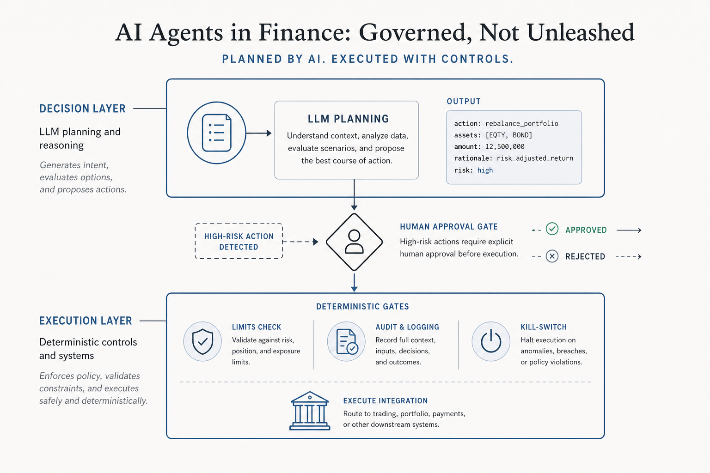
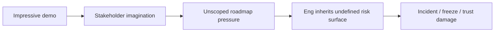
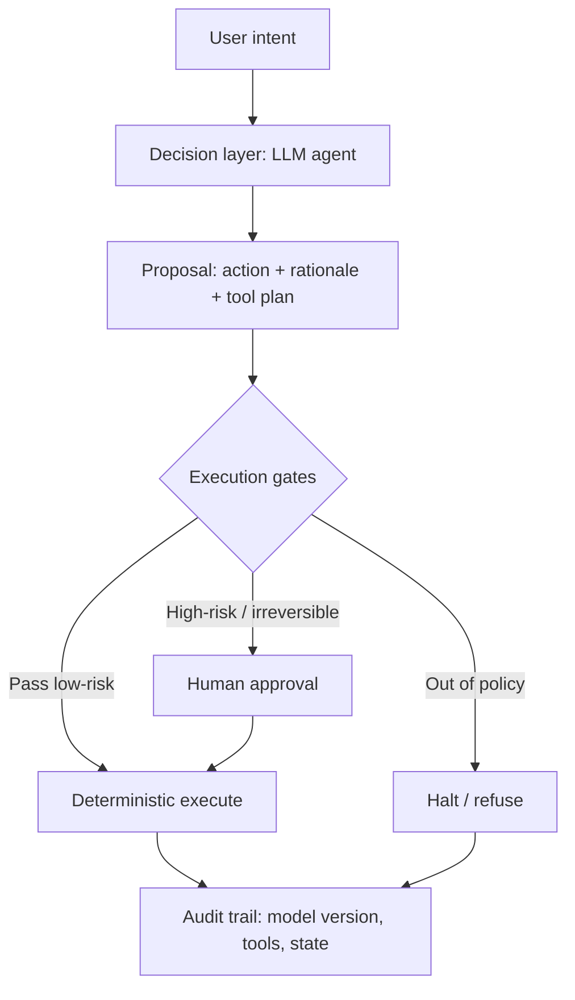

# Prototype aggressively. Productionize suspiciously.

**How to design AI agents near money without confusing a demo for a system**

**Series:** Build Notes · Article 03  
**Pillar:** AI that ships  
**Length:** ~1,900 words · **Read time:** ~8–9 min  
**Best channels:** Newsletter · LinkedIn long-form · talk deck  
**Status:** Draft v1 for your review

---

## TL;DR

AI makes it easier to **fake completeness**.

Trading and fintech products punish fake completeness.

The winning PM pattern in 2026 is not “fully autonomous agent.” It is **bounded autonomy**: agents that plan and assist fast, while deterministic gates own money movement, limits, audit, and halt.

Regulators and industry groups are converging here — from MAS’s **SAFR** (Safeguards for Agentic Finance at Runtime) to IMF notes on agentic payments emphasizing mandate-based authorization, separation of decision vs execution, audit trails, and tiered human-in-the-loop.

This essay turns that into a practical build ladder for PMs who can open a PR — without pretending a weekend prototype is a risk system.

---

## The demo that steals the roadmap

A fluent agent can:

- Explain a market in plain language  
- Draft a thesis  
- Suggest position sizing heuristics  
- Call tools, summarize feeds, generate a checklist  

Stakeholders watch for three minutes and mentally skip to:

> “So we can ship autonomous trading next quarter.”

That jump is the bug.

Your job as PM is to **keep two clocks honest**:

1. **Learning clock** — how fast we can prototype and discover UX truth  
2. **Risk clock** — how fast we can make failure non-catastrophic  

AI compresses (1). It does not automatically compress (2).

---

## What a weekend can and cannot validate

### Can validate (prototype zone)

| Question | Prototype method |
|----------|------------------|
| Is the explanation useful? | Wizard-of-Oz + real users |
| Where does the UX break? | Tool latency, memory, permissions |
| Do users over-trust fluent tone? | Observe behavior, not surveys only |
| What tools are even needed? | Thin agent + logged tool calls |

### Cannot validate (production zone)

| Question | Why a weekend fails |
|----------|---------------------|
| Risk controls | Need policy engines, limits, kill switches |
| Abuse / prompt injection | Adversaries don’t attend your demo |
| Regulatory boundaries | Legal is not a prompt |
| Liability & audit | Needs durable trails, ownership, incident process |
| Trust with money | Irreversibility changes user psychology |

Write this table into the PRD. Literally.

---

## Architecture that survives contact with money

Industry guidance keeps repeating a clean split:

**Decision layer** — LLM plans, interprets, proposes  
**Execution layer** — deterministic checks, mandates, limits, ledgers  

IMF-style mitigation themes for agentic payments include: mandate-based authorization, architectural separation of decision making and execution, agent identity, programmable controls, audit trails, tiered human oversight, and halt mechanisms.

MAS SAFR (Jul 2026) frames runtime safeguards: how actions are authorized, when humans are activated, what is recorded at decision time.

### Autonomy tiers (use in design reviews)

| Tier | Name | Example near trading | Default stance |
|------|------|----------------------|----------------|
| 1 | Assistive | Explain market, quiz user, summarize news | Ship early |
| 2 | Supervised autonomous | Place order **only after** explicit confirm + limit checks | Ship carefully |
| 3 | Fully autonomous | Agent trades within a mandate without per-trade approval | Rare; heavy governance |

If someone says “agent” without a tier, ask them to pick one.

---

## The PM build ladder (ship this sequence)

### Step 0 — Define non-autonomy

List actions that must **never** be autonomous in v1:

- Moving funds  
- Raising limits  
- Trading above $X / beyond market set  
- Changing account permissions  
- Anything irreversible without a clear mandate  

### Step 1 — Assistive agent in production

Ship explanation + education + checklist generation.  
No execution tools.

Success metric: users understand markets better / complete first competent trade faster — not “messages sent.”

### Step 2 — Proposal-only execution

Agent can draft an order ticket.  
User must confirm.  
Execution path is the same path as manual trading (re-use trusted rails).

### Step 3 — Bounded tools

Add tools with hard allowlists:

- Read-only market data  
- Portfolio read  
- “Create draft order”  

Not: arbitrary code, open web browse-to-trade, uncontrolled withdrawals.

### Step 4 — Mandates

User pre-commits: markets allowed, max notional/day, max loss, time window.  
Agent operates inside the mandate. Outside → refuse.

### Step 5 — Runtime safeguards

- Pre-commitment gates  
- Real-time monitoring + automatic halt  
- Post-action audit + reversal paths where legally/technically possible  

This is where SAFR-like thinking becomes product requirements, not a PDF.

---

## Eval before UI polish

Teams polish chat bubbles while skipping evals.

Minimum eval set for an agent near markets:

1. **Factuality** — does it invent resolution rules?  
2. **Refusal** — does it refuse disallowed actions?  
3. **Overconfidence** — does it present estimates as certainty?  
4. **Tool correctness** — wrong ticker / wrong market ID rate  
5. **Injection** — does hostile content in market metadata hijack tools?  
6. **Audit completeness** — can you reconstruct why it proposed X?

If you can’t measure these, you don’t have an AI product. You have a demo with CSS.

---

## How I use AI as a PM without lying to myself

(Personal operator angle — safe to publish)

Tools like Cursor / Claude Code changed my loop:

- Prototype the awkward edge case instead of only describing it  
- Feel latency and state bugs before eng translates a doc  
- Open small, reviewable PRs — not “PM rewrites the trading engine”

Rules that keep this healthy:

1. Prototype to learn  
2. PR only when scoped and reviewable  
3. Never confuse a demo with a production system — especially near money  

AI didn’t make strategy docs prettier.  
It made them honest faster.

---

## Multimodal pack

### A) LinkedIn carousel (8 slides)

1. Title + line: “AI fakes completeness. Trading punishes it.”  
2. Two clocks: learning vs risk  
3. Weekend can / cannot table (condensed)  
4. Decision vs execution diagram  
5. Autonomy tiers 1–3  
6. Build ladder steps 0–3  
7. Eval list (6 items)  
8. CTA: Build Notes / Market Ops Notes

### B) Talk slide (one banger)

Big text: **PROTOTYPE AGGRESSIVELY**  
Small text underneath: **productionize suspiciously**  
Diagram: Decision → Gates → Execute / Halt

### C) Short demo video (careful)

Show assistive agent explaining a **public** sample market.  
Hard cut to red screen: “No execution tools in this build — on purpose.”  
Explain gates.  
Do **not** show anything that looks like unsupervised live trading.

### D) Newsletter subject lines

- `Prototype aggressively. Productionize suspiciously.`  
- `Your agent demo is stealing the roadmap`  
- `Decision layer ≠ execution layer`

---

## Sources

1. MAS — Safeguards for Agentic Finance at Runtime (SAFR), 3 Jul 2026: https://www.mas.gov.sg/publications/monographs-or-information-paper/2026/safeguards-for-agentic-finance-at-runtime  
2. IMF Note — How Agentic AI Will Reshape Payments (2026): https://www.elibrary.imf.org/view/journals/068/2026/004/article-A001-en.xml  
3. Industry synthesis on bounded autonomy / fintech agents (secondary): https://uvik.net/blog/ai-in-fintech/  
4. Academic/practitioner governance framing on autonomy tiers in FS (Zenodo record on DORA / EU AI Act agent governance): https://doi.org/10.5281/zenodo.19750216  

---

## Compliance note for James

Safe to discuss general prototype lessons and public frameworks.  
Do **not** describe internal Crypto.com agent architecture, model vendors, or unreleased trading-agent features. Keep “I prototyped an AI trading agent” at the boundary level (what weekend can/can’t prove).

---

## LinkedIn atom

Pairs with: `posts/07-ai-trading-agent.md` and `posts/02-pm-opens-prs.md`
